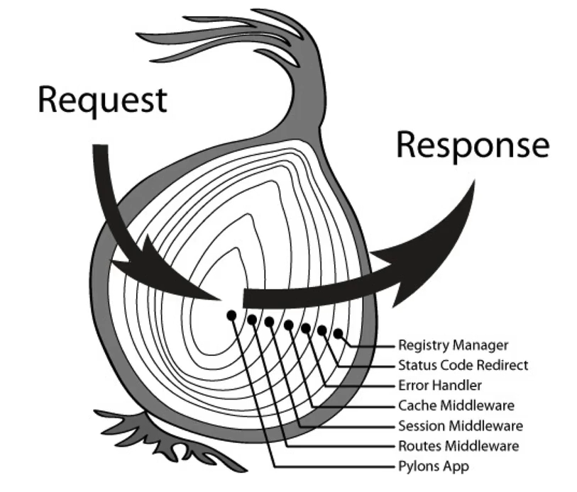

## 创建服务器

### 原生 node

1. 基本过程

   1. 引入 http 并创建服务器实例
   2. 绑定端口监听
   3. 完成响应。最后需要断开连接，否则请求流程不完整，客户端显示不了数据
   
2. 数据响应

   1. 设置响应头：` res.setHeader('Content-type', 'text/html;charset=utf-8') `
   2. 获取get/post请求参数
      1. get：` url.parse(req.url, true) `
      2. post：

      ```
      let params = ''
      req.on('data', (data) => {
       params += data
      })
      req.on('end', () => {
       console.log('post 请求参数：', qs.parse(params))
      })
      ```

   3. 写入数据：

      ```
      fs.readFile(__dirname + '/示例页面.html', 'utf-8', (err, data) => {
        if (err) {
          res.write('html request error')
          res.end()
        } else {
          res.write(data)
          res.end()
        }
      })
      ```

   4. 断开连接：` res.end() `

   5. ...

### express

1. 基本过程

   1. 创建实例
   2. 设置路由
   3. 设置监听

2. 数据响应。此处补充一些操作，具体 api 见官网文档

   1. 将 readFile promise 化，用于避免产生回调地狱
   2. 请求头：` req.headers `
   3. 请求体：` req.body `

3. ...

### koa

1. 上下文 Context

   Koa Context 将 node 的 request 和 response 对象封装到单个对象中，每个请求都将创建一个 context，并在中间件中作为接收器引用，或者 ctx 标识符，如以下代码片段所示：

   ```javascript
   app.use(async ctx => {
     ctx // is the Context
     ctx.request // is a Koa Request
     ctx.response // is a Koa Response
   })
   ```

  注：绕过 Koa 的 response 处理是不被支持的，应避免使用如 res.end() 的 node 属性。

2. 洋葱圈模型

   

3. 路由

   1. 实现路由架构：使用@koa/router
   2. 传参处理：
      1. 动态参数：ctx.params
      2. query 参数：ctx.query
      3. body 参数：使用 koa-body

4. 错误异常接管

    1. 使用 throw 抛出异常：`ctx.throw(400, '400 错误')`
    2. 使用错误事件监听的方式抛出异常
