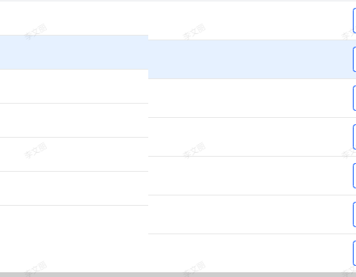

#### 1.纵向/列对不齐

1.1  有列(column)没有设置宽度： 为所有column设置width（或统一赋默认值）

```vue
const width = item.width || 100;
```

##### 1.2.语句/单词过长：

a. 打破语句与单词，强制折行;
```vue
.ant-table-thead > tr > th, .ant-table-tbody > tr > td {
  padding: 16px 16px;
  word-break: break-word;
  -ms-word-break: break-all;
}
```

b. 当column自定义了render，并在render中嵌套了dom元素,需在dom内联样式中设置

```vue
 word-break: break-word；
```

##### 1.3.开启了单选功能

给单选的表头添加文字，例如demo中的“单选”，撑开表头


### 2.横向/行对不齐

##### 2.1.固定(fixed)列的高度高于普通列



强制为表格添加行高 （ 行高>默认高度 ）

```vue
/deep/ .ant-table-tbody > tr > td {
  height: 54px;
}
```


#### 3.双滚动条

##### 4.1.macOS在系统偏好设置为 “显示滚动条-滚动时”会出现双滚动条: 自定义滚动条， 滚动条常显

```vue
::-webkit-scrollbar{
  width:12px;
  height:12px;
}
::-webkit-scrollbar-track-piece {
  background-color: #f8f8f8;
}
::-webkit-scrollbar-thumb{
  border: 3px solid #f6f6f6;
  background-color: #ccc;
  -webkit-border-radius:20px;
}
::-webkit-scrollbar-thumb:active{
  -webkit-border-radius:20px;
  background-color: #7f7f7f;
}
::-webkit-scrollbar-corner {
  background-color: #f6f6f6;
  -webkit-border-bottom-right-radius: 5px;
}

.navigation::-webkit-scrollbar {
  width: 3px;
  height: 0px;
}
.navigation::-webkit-scrollbar-button {
  display: none;
}
.navigation::-webkit-scrollbar-track-piece {
  background-color: #404040;
}
.navigation::-webkit-scrollbar-thumb {
  border: 1px solid rgb(52, 143, 247);
  background-color: rgb(52, 143, 247);
  -webkit-border-radius: 3px;
  border-radius: 3px;
}
```

