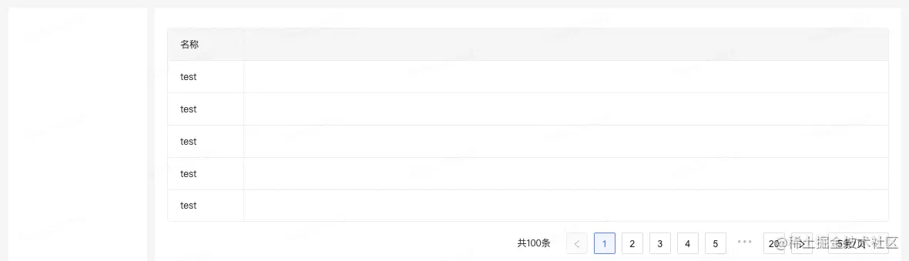
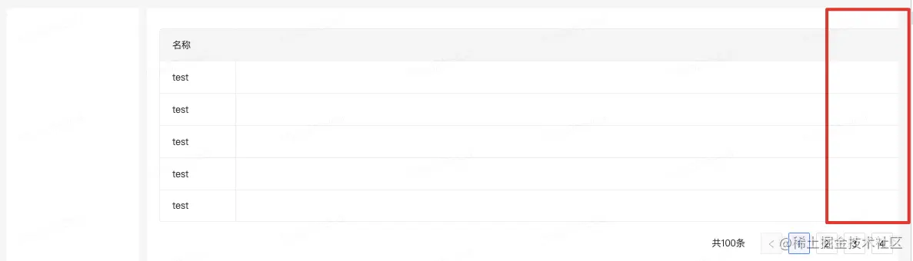
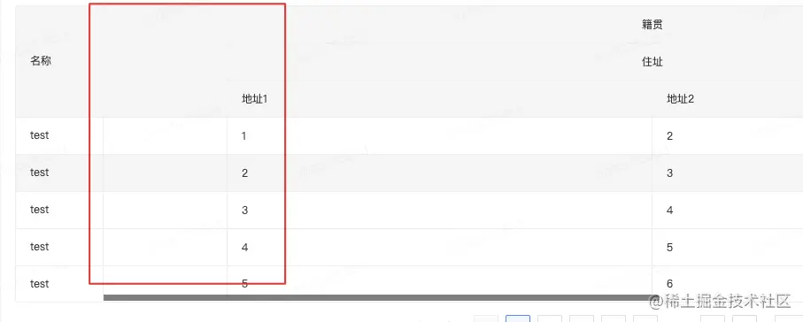
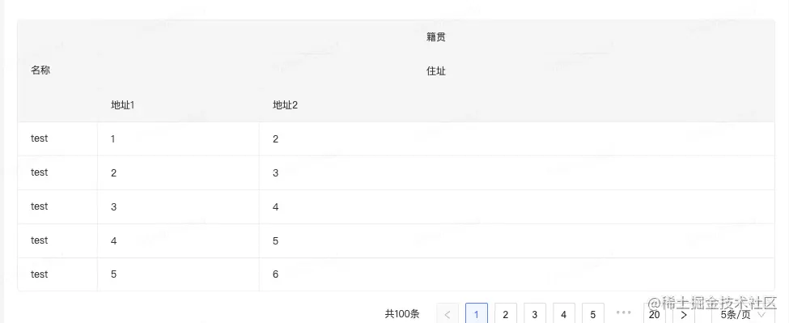
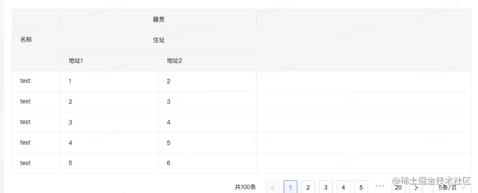

### 弹性布局引发的antd中a-table滚动失效

最近项目研发过程中，碰到一个问题，在此记录一下，也可能是我自己的专属bug。。。

需求是这样的，做一个表格查询，如下：



看到左右布局，用flex比较方便，右侧内容区域自适应，flex：1，很快样式出来了

```css
css复制代码.main {
   display: flex;
   .left {
       width: 100px;
   }
   .right {
       flex: 1;
   }
}
```

接下来加入表格，项目中使用的是ant design vue，用a-table来实现，由于表格的列很多，需要固定第一列，其他列左右滚动显示

```ini
ini复制代码<a-table
    :columns="columns"
    :data-source="tableData"
    :scroll="{ x: 1200, y: 300 }">
</a-table>      
```

这时候问题就来了



很明显表格超出右侧内容区域了，也不能滚动了，经过一番调整，是因为flex为1时，宽度自动分配，当表格宽度超出内容区域时就会出现这类问题，解决方案

```css
css复制代码.right {
    flex: 1;
    overflow: hidden;
}
```

继续开发，表格中加入数据，当只有一条数据时，



出现了空白行，很难受，查找了一下，官方文档提示 


```ini
ini复制代码const columns = [
    {
        title: '籍贯',
        children: [
            {
                title: '住址',
                children: [
                    {
                        title: '地址1',
                        dataIndex: 'address1',
                        width: 200
                    },
                    {
                        title: '地址2',
                        dataIndex: 'address2'
                    }
                ]
            }
        ]
    }
];
```

之前是列都指定了width，现在去掉'地址2'的width属性，表格可以展示了但是感觉很奇怪，由于该列是自适应的所以会比较长，像这样



把width加回来，再优化，可以加一行空列，会看起来好一些，数据多了后空白就会被填充了

```ini
ini复制代码const columns = [
    ...,
    {
        title: ''
    }
];
```



作者：小剛
链接：https://juejin.cn/post/7023707277643218951
来源：稀土掘金
著作权归作者所有。商业转载请联系作者获得授权，非商业转载请注明出处。