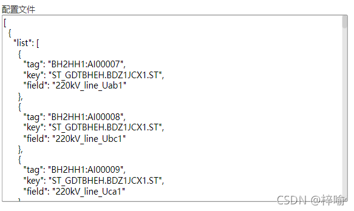

##### 1. 封装JSON请求方法

> 1 安装 axios

```npm install axios```

> 2 引入并封装a xios请求

路径 **src/utils/requestJSON.js**

``` vue
import axios from 'axios';
// create an axios instance
const service = axios.create({
  method: 'get',
  crossDomain: true,
  dataType: 'json',
  baseURL: '',
  // withCredentials: true, 
  // send cookies when cross-domain requests
  timeout: 5000 // axios.createrequest timeout
});
// request interceptor
service.interceptors.request.use(
  config => {
    // do something before request is sent
    return config;
  },
  error => {
    // do something with request error
    return Promise.reject(error);
  }
);
// response interceptor
service.interceptors.response.use(
  /**
   * If you want to get http information such as headers or code
   * Please return  response => response

    */
  /**
   * Determine the request code by custom code
   * Here is just an example
   * You can also judge the status by HTTP Status Code
      */
    response => {
    const res = response.data;
    // console.log(response);
    if (!res) {
      const errorMsg = 
      	response.config.url ? `加载"${response.config.url}"失败` 
      		: '请指定所需加载的JSON地址';
      alert(errorMsg);
      return Promise.reject(new Error(errorMsg));
    }
    return res;
  },
  error => {
    alert(error.message);
    return Promise.reject(error);
  }
);
export default service;
```

> 3 封装请求JSON接口

路径 src/api/getJSON.js

```vue
import requestJSON from '@/utils/requestJSON';

/**
@description 加载JSON文件
@param { string } url
*/
  export function getJSON(url) {
    return requestJSON({
    url
    });
  }
```

##### 2. 加载并显示JSON


 ``` vue

<!-- 偷懒用textarea直接输出json文本, readonly是不让用户编辑 -->
<template>
	<textarea readonly :value="value" />
</template>
<script>
import getJSON from '@/api/getJSON';
export default {
	data() {
		return {
			value: ''
		}
	},
	created() {
	    const jsonURL = '/path/data.json'; //	某个json文件
		getJSON(jsonURL).then(json => {
			this.value = JSON.stringify(json, null, 2);
		})	
	}
}
</script>
 ```


[JSON.stringify() 方法将一个 JavaScript 对象或值转换为 JSON 字符串](https://developer.mozilla.org/zh-CN/docs/Web/JavaScript/Reference/Global_Objects/JSON/stringify)


效果如下




原文链接：https://blog.csdn.net/wzp20092009/article/details/120653124