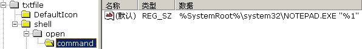

# 注册表

## 介绍

**注册表**（英语：Registry，中国大陆译作**注册表**，港澳台译作**登录档**）是Microsoft Windows操作系统和其应用程序中的一个重要的层次型数据库，用于存储系统和应用程序的设置信息。

## 数据结构[[编辑](https://zh.wikipedia.org/w/index.php?title=注册表&action=edit&section=5)]

注册表由键（key，或称“项”）、子键（subkey，子项）和值项（value）构成。一个键就是树状数据结构中的一个节点，而子键就是这个节点的子节点，子键也是键。一个值项则是一个键的一条属性，由名称（name）、数据类型（datatype）以及数据（data）组成。一个键可以有一个或多个值，每个值的名称各不相同，如果一个值的名称为空，则该值为该键的默认值。

在注册表编辑器（Regedit.exe）中，数据结构显示如下，其中，**command**键是**open**键的子键，**(默认)**表示该值是默认值，值名称为空，其数据类型为**REG_SZ**，数据值为**%systemroot%\system32\NOTEPAD.EXE "%1**

以上信息的意义是：txt类型的文件在右键菜单里的“打开”一项使用的程序是“NOTEPAD.EXE”，即用记事本打开文件。

### 数据类型[[编辑](https://zh.wikipedia.org/w/index.php?title=注册表&action=edit&section=6)]

注册表的数据类型主要有以下五种：

| 显示类型（在编辑器中） |   数据类型   |                             说明                             |
| :--------------------: | :----------: | :----------------------------------------------------------: |
|         REG_SZ         |    字符串    |                          文本字符串                          |
|       REG_BINARY       |   二进制数   |              不定长度的二进制值，以十六进制显示              |
|       REG_DWORD        |     双字     |        一个 32 位的二进制值，显示为 8 位的十六进制值         |
|      REG_MULTI_SZ      |   多字符串   | 含有多个文本值的字符串，此名来源于字符串间用 nul 分隔、结尾两个 nul |
|     REG_EXPAND_SZ      | 可扩展字符串 |                     含有环境变量的字符串                     |

此外，注册表还有其他的数据类型，但是均不常用：

- REG_DWORD_BIG_ENDIAN - DWORD 的[大头](https://zh.wikipedia.org/wiki/字节序)版本，下面同理
- REG_DWORD_LITTLE_ENDIAN
- REG_FULL_RESOURCE_DESCRIPTOR
- REG_QWORD - DWORD 的四字（64 位）版本
- REG_FILE_NAME

### 注册表的分支结构[[编辑](https://zh.wikipedia.org/w/index.php?title=注册表&action=edit&section=7)]

注册表有五个一级分支，下面是这五个分支的名称及作用：

|        名称         |                           作用                            |
| :-----------------: | :-------------------------------------------------------: |
|  HKEY_CLASSES_ROOT  | 存储Windows可识别的文件类型的详细列表，以及相关联的程序。 |
|  HKEY_CURRENT_USER  |                 存储当前用户设置的信息。                  |
| HKEY_LOCAL_MACHINE  |          包括安装在计算机上的硬件和软件的信息。           |
|     HKEY_USERS      |               包含使用计算机的用户的信息。                |
| HKEY_CURRENT_CONFIG |          这个分支包含计算机当前的硬件配置信息。           |