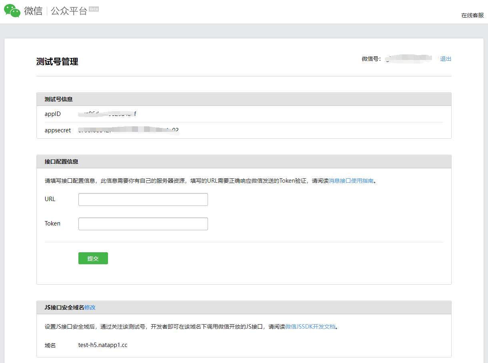
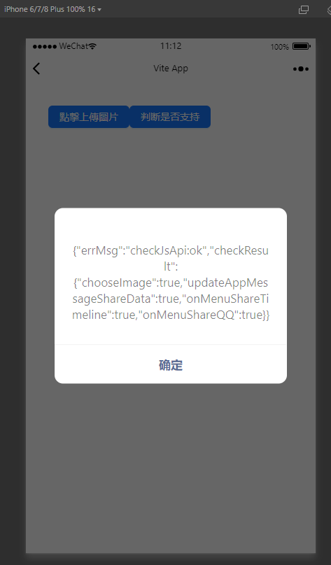
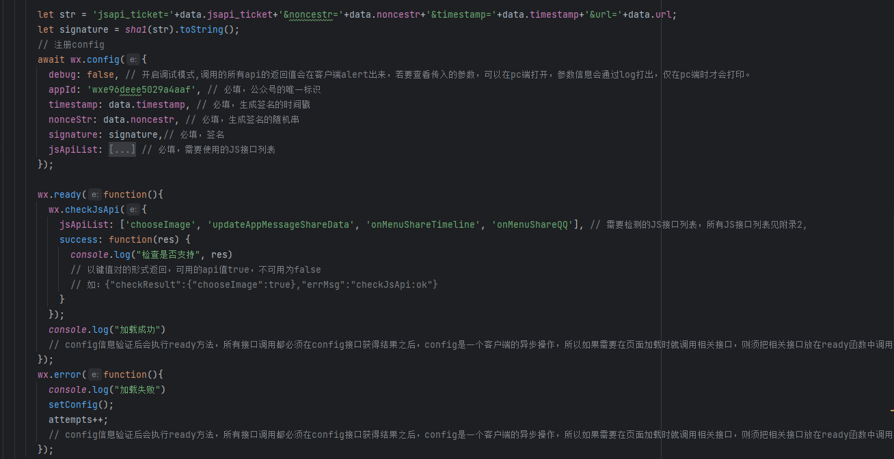
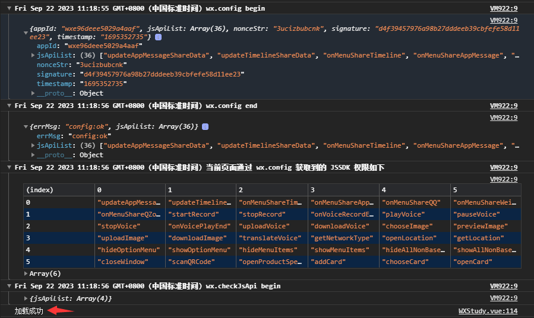
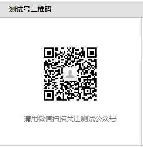
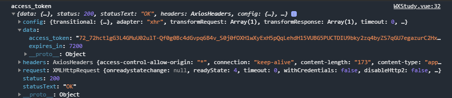
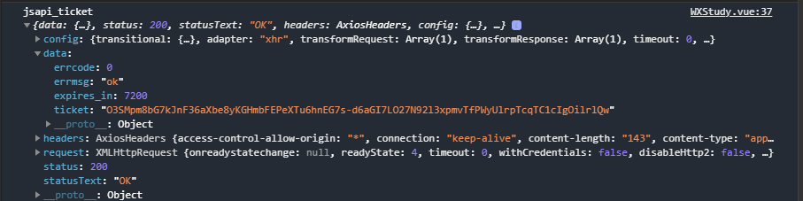
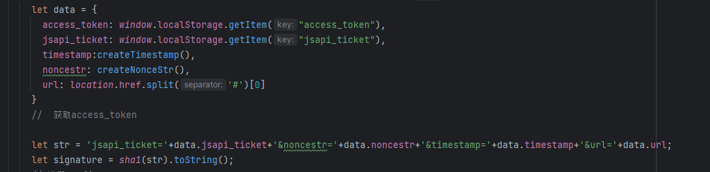

# **概述**

微信JS-SDK是[微信公众平台](https://mp.weixin.qq.com/cgi-bin/loginpage?t=wxm2-login&lang=zh_CN) 面向网页开发者提供的基于微信内的网页开发工具包。

通过使用微信JS-SDK，网页开发者可借助微信高效地使用拍照、选图、语音、位置等手机系统的能力，同时可以直接使用微信分享、扫一扫、卡券、支付等微信特有的能力，为微信用户提供更优质的网页体验。


# **JSSDK使用步骤**


#### **步骤一：绑定域名**

先登录微信公众平台进入“公众号设置”的“功能设置”里填写“JS接口安全域名”。

备注：登录后可在“开发者中心”查看对应的接口权限。

>  **注：** 测试开发时，在微信测试号内绑定JS接口安全域名之后，可以通过此域名进行测试开发
>
> 

#### **步骤二：引入JS文件**

在需要调用JS接口的页面引入如下JS文件，（支持https）：http://res.wx.qq.com/open/js/jweixin-1.6.0.js

如需进一步提升服务稳定性，当上述资源不可访问时，可改访问：http://res2.wx.qq.com/open/js/jweixin-1.6.0.js （支持https）。

备注：支持使用 AMD/CMD 标准模块加载方法加载  [AMD/CMD 简要介绍](https://www.cnblogs.com/chenwenhao/p/12153332.html) [介绍2](https://blog.csdn.net/chen__cheng/article/details/114823719)


#### **步骤三：通过config接口注入权限验证配置**

所有需要使用JS-SDK的页面必须先注入配置信息，否则将无法调用（同一个url仅需调用一次，对于变化url的SPA(单页面应用)的web app可在每次url变化时进行调用,目前Android微信客户端不支持pushState(修改当前页面在 history 中的记录，不刷新页面，例如Vue的路由)的H5新特性，所以使用pushState来实现web app的页面会导致签名失败，此问题会在Android6.2中修复）。

```js
wx.config({
  debug: true, // 开启调试模式,调用的所有api的返回值会在客户端alert出来，若要查看传入的参数，可以在pc端打开，参数信息会通过log打出，仅在pc端时才会打印。
  appId: '', // 必填，公众号的唯一标识
  timestamp: , // 必填，生成签名的时间戳
  nonceStr: '', // 必填，生成签名的随机串
  signature: '',// 必填，签名
  jsApiList: [] // 必填，需要使用的JS接口列表
});
```

签名算法见文末的[附录1](#附录1-JS-SDK使用权限签名算法)，所有JS接口列表见文末的[附录2](#附录2-所有JS接口列表)

注意：如果使用的是[小程序云开发静态网站托管](https://developers.weixin.qq.com/miniprogram/dev/wxcloud/guide/staticstorage/introduction.html)的域名的网页，可以免鉴权直接跳任意合法合规小程序，调用 wx.config 时 appId 需填入非个人主体的已认证小程序，不需计算签名，timestamp、nonceStr、signature 填入非空任意值即可。


>  调试模式
>
> 


#### **步骤四：通过ready接口处理成功验证**

```js
wx.ready(function(){
  // config信息验证后会执行ready方法，所有接口调用都必须在config接口获得结果之后，config是一个客户端的异步操作，所以如果需要在页面加载时就调用相关接口，则须把相关接口放在ready函数中调用来确保正确执行。对于用户触发时才调用的接口，则可以直接调用，不需要放在ready函数中。
});
```


#### **步骤五：通过error接口处理失败验证**

```js
wx.error(function(res){
  // config信息验证失败会执行error函数，如签名过期导致验证失败，具体错误信息可以打开config的debug模式查看，也可以在返回的res参数中查看，对于SPA可以在这里更新签名。
});
```



**结果：**



### **接口调用说明**

所有接口通过wx对象(也可使用jWeixin对象)来调用，参数是一个对象，除了每个接口本身需要传的参数之外，还有以下通用参数：

1. success：接口调用成功时执行的回调函数。
2. fail：接口调用失败时执行的回调函数。
3. complete：接口调用完成时执行的回调函数，无论成功或失败都会执行。
4. cancel：用户点击取消时的回调函数，仅部分有用户取消操作的api才会用到。
5. trigger: 监听Menu中的按钮点击时触发的方法，该方法仅支持Menu中的相关接口。

备注：不要尝试在trigger中使用ajax异步请求修改本次分享的内容，因为客户端分享操作是一个同步操作，这时候使用ajax的回包会还没有返回。

以上几个函数都带有一个参数，类型为对象，其中除了每个接口本身返回的数据之外，还有一个通用属性errMsg，其值格式如下：

调用成功时："xxx:ok" ，其中xxx为调用的接口名

用户取消时："xxx:cancel"，其中xxx为调用的接口名

调用失败时：其值为具体错误信息


下面可以扫描二维码访问网页，边听介绍，边查看一些简短的示例吧。

请先关注公众号测试号，请用微信扫描




然后再扫描网页二维码


# **基础接口**


### **判断当前客户端版本是否支持指定JS接口**

```js
wx.checkJsApi({
  jsApiList: ['chooseImage'], // 需要检测的JS接口列表，所有JS接口列表见附录2,
  success: function(res) {
  // 以键值对的形式返回，可用的api值true，不可用为false
  // 如：{"checkResult":{"chooseImage":true},"errMsg":"checkJsApi:ok"}
  }
});
```

备注：checkJsApi接口是客户端6.0.2新引入的一个预留接口，第一期开放的接口均可不使用checkJsApi来检测。


# **分享接口**

请注意，不要有诱导分享等违规行为，对于诱导分享行为将永久回收公众号接口权限，详细规则请查看：[朋友圈管理常见问题](https://kf.qq.com/faq/161223JfINJV1612237buYri.html)

请注意，原有的 `wx.onMenuShareTimeline`、`wx.onMenuShareAppMessage`、`wx.onMenuShareQQ`、`wx.onMenuShareQZone` 接口，即将废弃。请尽快迁移使用客户端6.7.2及JSSDK 1.4.0以上版本支持的 `wx.updateAppMessageShareData`、`wx.updateTimelineShareData`接口。


### **自定义“分享给朋友”及“分享到QQ”按钮的分享内容（1.4.0）**

```js
wx.ready(function () {   //需在用户可能点击分享按钮前就先调用
  wx.updateAppMessageShareData({ 
    title: '', // 分享标题
    desc: '', // 分享描述
    link: '', // 分享链接，该链接域名或路径必须与当前页面对应的公众号JS安全域名一致
    imgUrl: '', // 分享图标
    success: function () {
      // 设置成功
    }
  })
}); 
```


### **自定义“分享到朋友圈”及“分享到QQ空间”按钮的分享内容（1.4.0）**

```js
wx.ready(function () {      //需在用户可能点击分享按钮前就先调用
  wx.updateTimelineShareData({ 
    title: '', // 分享标题
    link: '', // 分享链接，该链接域名或路径必须与当前页面对应的公众号JS安全域名一致
    imgUrl: '', // 分享图标
    success: function () {
      // 设置成功
    }
  })
}); 
```


### **获取“分享到朋友圈”按钮点击状态及自定义分享内容接口（即将废弃）**

```js
wx.onMenuShareTimeline({
  title: '', // 分享标题
  link: '', // 分享链接，该链接域名或路径必须与当前页面对应的公众号JS安全域名一致
  imgUrl: '', // 分享图标
  success: function () {
  // 用户点击了分享后执行的回调函数
  }
},
```


### **获取“分享给朋友”按钮点击状态及自定义分享内容接口（即将废弃）**

```js
wx.onMenuShareAppMessage({
  title: '', // 分享标题
  desc: '', // 分享描述
  link: '', // 分享链接，该链接域名或路径必须与当前页面对应的公众号JS安全域名一致
  imgUrl: '', // 分享图标
  type: '', // 分享类型,music、video或link，不填默认为link
  dataUrl: '', // 如果type是music或video，则要提供数据链接，默认为空
  success: function () {
    // 用户点击了分享后执行的回调函数
  }
});
```


### **获取“分享到QQ”按钮点击状态及自定义分享内容接口（即将废弃）**

```js
wx.onMenuShareQQ({
  title: '', // 分享标题
  desc: '', // 分享描述
  link: '', // 分享链接
  imgUrl: '', // 分享图标
  success: function () {
  // 用户确认分享后执行的回调函数
  },
  cancel: function () {
  // 用户取消分享后执行的回调函数
  }
});
```


### **获取“分享到腾讯微博”按钮点击状态及自定义分享内容接口**

```js
wx.onMenuShareWeibo({
  title: '', // 分享标题
  desc: '', // 分享描述
  link: '', // 分享链接
  imgUrl: '', // 分享图标
  success: function () {
  // 用户确认分享后执行的回调函数
  },
  cancel: function () {
  // 用户取消分享后执行的回调函数
  }
});
```


### **获取“分享到QQ空间”按钮点击状态及自定义分享内容接口（即将废弃）**

```js
wx.onMenuShareQZone({
  title: '', // 分享标题
  desc: '', // 分享描述
  link: '', // 分享链接
  imgUrl: '', // 分享图标
  success: function () {
  // 用户确认分享后执行的回调函数
  },
  cancel: function () {
  // 用户取消分享后执行的回调函数
  }
});
```


# **图像接口**


### **拍照或从手机相册中选图接口**

```js
wx.chooseImage({
  count: 1, // 默认9
  sizeType: ['original', 'compressed'], // 可以指定是原图还是压缩图，默认二者都有
  sourceType: ['album', 'camera'], // 可以指定来源是相册还是相机，默认二者都有
  success: function (res) {
  var localIds = res.localIds; // 返回选定照片的本地ID列表，localId可以作为img标签的src属性显示图片
  }
});
```


### **预览图片接口**

```js
wx.previewImage({
  current: '', // 当前显示图片的http链接
  urls: [] // 需要预览的图片http链接列表
});
```


### **上传图片接口**

```js
wx.uploadImage({
  localId: '', // 需要上传的图片的本地ID，由chooseImage接口获得
  isShowProgressTips: 1, // 默认为1，显示进度提示
  success: function (res) {
    var serverId = res.serverId; // 返回图片的服务器端ID
  }
});
```

备注：上传图片有效期3天，可用微信多媒体接口下载图片到自己的服务器，此处获得的 serverId 即 media_id。


### **下载图片接口**

```js
wx.downloadImage({
  serverId: '', // 需要下载的图片的服务器端ID，由uploadImage接口获得
  isShowProgressTips: 1, // 默认为1，显示进度提示
  success: function (res) {
    var localId = res.localId; // 返回图片下载后的本地ID
  }
});
```


### **获取本地图片接口**

```js
wx.getLocalImgData({
  localId: '', // 图片的localID
  success: function (res) {
    var localData = res.localData; // localData是图片的base64数据，可以用img标签显示
  }
});
```

备注：此接口仅在 iOS WKWebview 下提供，用于兼容 iOS WKWebview 不支持 localId 直接显示图片的问题。具体可参考《[iOS WKWebview网页开发适配指南](https://developers.weixin.qq.com/doc/offiaccount/OA_Web_Apps/iOS_WKWebview)》


# **音频接口**


### **开始录音接口**

```js
wx.startRecord();
```


### **停止录音接口**

```js
wx.stopRecord({
  success: function (res) {
    var localId = res.localId;
  }
});
```


### **监听录音自动停止接口**

```js
wx.onVoiceRecordEnd({
// 录音时间超过一分钟没有停止的时候会执行 complete 回调
  complete: function (res) {
  var localId = res.localId;
}
});
```


### **播放语音接口**

```js
wx.playVoice({
  localId: '' // 需要播放的音频的本地ID，由stopRecord接口获得
});
```


### **暂停播放接口**

```js
wx.pauseVoice({
  localId: '' // 需要暂停的音频的本地ID，由stopRecord接口获得
});
```


### **停止播放接口**

```js
wx.stopVoice({
  localId: '' // 需要停止的音频的本地ID，由stopRecord接口获得
});
```


### **监听语音播放完毕接口**

```js
wx.onVoicePlayEnd({
  success: function (res) {
    var localId = res.localId; // 返回音频的本地ID
  }
});
```


### **上传语音接口**

```js
wx.uploadVoice({
  localId: '', // 需要上传的音频的本地ID，由stopRecord接口获得
  isShowProgressTips: 1, // 默认为1，显示进度提示
  success: function (res) {
    var serverId = res.serverId; // 返回音频的服务器端ID
  }
});
```

备注：上传语音有效期3天，可用微信多媒体接口下载语音到自己的服务器，此处获得的 serverId 即 media_id，参考文档 .目前多媒体文件下载接口的频率限制为10000次/天，如需要调高频率，请登录微信公众平台，在开发 - 接口权限的列表中，申请提高临时上限。


### **下载语音接口**

```js
wx.downloadVoice({
  serverId: '', // 需要下载的音频的服务器端ID，由uploadVoice接口获得
  isShowProgressTips: 1, // 默认为1，显示进度提示
  success: function (res) {
    var localId = res.localId; // 返回音频的本地ID
  }
});
```


# **智能接口**


### **识别音频并返回识别结果接口**

```js
wx.translateVoice({
  localId: '', // 需要识别的音频的本地Id，由录音相关接口获得
  isShowProgressTips: 1, // 默认为1，显示进度提示
  success: function (res) {
    alert(res.translateResult); // 语音识别的结果
  }
});
```


# **设备信息**


### **获取网络状态接口**

```js
wx.getNetworkType({
  success: function (res) {
    var networkType = res.networkType; // 返回网络类型2g，3g，4g，wifi
  }
});
```


# **地理位置**


### **使用微信内置地图查看位置接口**

```js
wx.openLocation({
  latitude: 0, // 纬度，浮点数，范围为90 ~ -90
  longitude: 0, // 经度，浮点数，范围为180 ~ -180。
  name: '', // 位置名
  address: '', // 地址详情说明
  scale: 1, // 地图缩放级别,整型值,范围从1~28。默认为最大
  infoUrl: '' // 在查看位置界面底部显示的超链接,可点击跳转
});
```


### **获取地理位置接口**

```js
wx.getLocation({
  type: 'wgs84', // 默认为wgs84的gps坐标，如果要返回直接给openLocation用的火星坐标，可传入'gcj02'
  success: function (res) {
    var latitude = res.latitude; // 纬度，浮点数，范围为90 ~ -90
    var longitude = res.longitude; // 经度，浮点数，范围为180 ~ -180。
    var speed = res.speed; // 速度，以米/每秒计
    var accuracy = res.accuracy; // 位置精度
  }
});
```


# **摇一摇周边**


### **开启查找周边ibeacon设备接口**

```js
wx.startSearchBeacons({
  ticket:"",  //摇周边的业务ticket, 系统自动添加在摇出来的页面链接后面
  complete:function(argv){
    //开启查找完成后的回调函数
  }
});
```

备注：如需接入摇一摇周边功能，请参考：申请开通摇一摇周边


### **关闭查找周边ibeacon设备接口**

```js
wx.stopSearchBeacons({
  complete:function(res){
    //关闭查找完成后的回调函数
  }
});
```


### **监听周边ibeacon设备接口**

```js
wx.onSearchBeacons({
  complete:function(argv){
    //回调函数，可以数组形式取得该商家注册的在周边的相关设备列表
  }
});
```

备注：上述摇一摇周边接口使用注意事项及更多返回结果说明，请参考：摇一摇周边获取设备信息


# **界面操作**


### **关闭当前网页窗口接口**

```js
wx.closeWindow();
```


### **批量隐藏功能按钮接口**

```js
wx.hideMenuItems({
  menuList: [] // 要隐藏的菜单项，只能隐藏“传播类”和“保护类”按钮，所有menu项见附录3
});
```


### **批量显示功能按钮接口**

```js
wx.showMenuItems({
  menuList: [] // 要显示的菜单项，所有menu项见附录3
});
```


### **隐藏所有非基础按钮接口**

```js
wx.hideAllNonBaseMenuItem();
// “基本类”按钮详见附录3
```


### **显示所有功能按钮接口**

```js
wx.showAllNonBaseMenuItem();
```


# **微信扫一扫**


### **调起微信扫一扫接口**

```js
wx.scanQRCode({
  needResult: 0, // 默认为0，扫描结果由微信处理，1则直接返回扫描结果，
  scanType: ["qrCode","barCode"], // 可以指定扫二维码还是一维码，默认二者都有
  success: function (res) {
    var result = res.resultStr; // 当needResult 为 1 时，扫码返回的结果
  }
});
```


# **微信小店**


### **跳转微信商品页接口**

```js
wx.openProductSpecificView({
  productId: '', // 商品id
  viewType: '' // 0.默认值，普通商品详情页1.扫一扫商品详情页2.小店商品详情页
});
```


# **微信卡券**

微信卡券接口中使用的签名凭证api_ticket，与步骤三中config使用的签名凭证jsapi_ticket不同，开发者在调用微信卡券JS-SDK的过程中需依次完成两次不同的签名，并确保凭证的缓存。


### **获取api_ticket**

api_ticket 是用于调用微信卡券JS API的临时票据，有效期为7200 秒，通过access_token 来获取。

开发者注意事项：

1. 此用于卡券接口签名的api_ticket与步骤三中通过config接口注入权限验证配置使用的jsapi_ticket不同。
2. 由于获取api_ticket 的api 调用次数非常有限，频繁刷新api_ticket 会导致api调用受限，影响自身业务，开发者需在自己的服务存储与更新api_ticket。

**接口调用请求说明**

> http请求方式: GET https://api.weixin.qq.com/cgi-bin/ticket/getticket?access_token=ACCESS_TOKEN&type=wx_card

**参数说明**

| 参数         | 是否必须 | 说明         |
| :----------- | :------- | :----------- |
| access_token | 是       | 接口调用凭证 |

**返回数据**

**数据示例：**

```json
{
  "errcode":0,
  "errmsg":"ok",
  "ticket":"bxLdikRXVbTPdHSM05e5u5sUoXNKdvsdshFKA",
  "expires_in":7200
}
```

| 参数名     | 描述                               |
| :--------- | :--------------------------------- |
| errcode    | 错误码                             |
| errmsg     | 错误信息                           |
| ticket     | api_ticket，卡券接口中签名所需凭证 |
| expires_in | 有效时间                           |

错误码

| 错误码 | 错误信息     |
| :----- | :----------- |
| 40097  | type参数错误 |


### **拉取适用卡券列表并获取用户选择信息**

```js
wx.chooseCard({
  shopId: '', // 门店Id
  cardType: '', // 卡券类型
  cardId: '', // 卡券Id
  timestamp: 0, // 卡券签名时间戳
  nonceStr: '', // 卡券签名随机串
  signType: '', // 签名方式，默认'SHA1'
  cardSign: '', // 卡券签名
  success: function (res) {
    var cardList= res.cardList; // 用户选中的卡券列表信息
  }
});
```

| 参数名    | 必填 | 类型       | 示例值                      | 描述                                                         |
| :-------- | :--- | :--------- | :-------------------------- | :----------------------------------------------------------- |
| shopId    | 否   | string(24) | 1234                        | 门店ID。shopID用于筛选出拉起带有指定location_list(shopID)的卡券列表，非必填。 |
| cardType  | 否   | string(24) | GROUPON                     | 卡券类型，用于拉起指定卡券类型的卡券列表。当cardType为空时，默认拉起所有卡券的列表，非必填。 |
| cardId    | 否   | string(32) | p1Pj9jr90_SQRaVqYI239Ka1erk | 卡券ID，用于拉起指定cardId的卡券列表，当cardId为空时，默认拉起所有卡券的列表，非必填。 |
| timestamp | 是   | string(32) | 14300000000                 | 时间戳。                                                     |
| nonceStr  | 是   | string(32) | sduhi123                    | 随机字符串。                                                 |
| signType  | 是   | string(32) | SHA1                        | 签名方式，目前仅支持SHA1                                     |
| cardSign  | 是   | string(64) | abcsdijcous123              | 签名。                                                       |

`cardSign` 详见附录4。

开发者特别注意：签名错误会导致拉取卡券列表异常为空，请仔细检查参与签名的参数有效性。

**特别提醒**

拉取列表仅与用户本地卡券有关，拉起列表异常为空的情况通常有三种：签名错误、时间戳无效、筛选机制有误。请开发者依次排查定位原因。


### **批量添加卡券接口**

```js
wx.addCard({
  cardList: [{
    cardId: '',
    cardExt: ''
  }], // 需要添加的卡券列表
  success: function (res) {
    var cardList = res.cardList; // 添加的卡券列表信息
  }
});
```

`cardExt` 详见附录4，开发者若调用接口报签名错误、已领完等异常情况可以参照：[卡券签名错误排查方法](http://mp.weixin.qq.com/s/WhYpWmfuhUBw2wseTXdt2A)


### **查看微信卡包中的卡券接口**

```js
wx.openCard({
  cardList: [{
    cardId: '',
    code: ''
  }]// 需要打开的卡券列表
});
```


# **微信支付**


### **发起一个微信支付请求**

请参考微信支付文档，JSAPI调起支付API：https://pay.weixin.qq.com/wiki/doc/apiv3/apis/chapter3_1_4.shtml

备注：

微信支付V2的开发文档：https://pay.weixin.qq.com/wiki/doc/api/index.html

微信支付V3的开发文档：https://pay.weixin.qq.com/wiki/doc/apiv3/index.shtml


# **快速输入**


### **共享收货地址接口**

```js
wx.openAddress({
  success: function (res) {
    var userName = res.userName; // 收货人姓名
    var postalCode = res.postalCode; // 邮编
    var provinceName = res.provinceName; // 国标收货地址第一级地址（省）
    var cityName = res.cityName; // 国标收货地址第二级地址（市）
    var countryName = res.countryName; // 国标收货地址第三级地址（国家）
    var detailInfo = res.detailInfo; // 详细收货地址信息
    var nationalCode = res.nationalCode; // 收货地址国家码
    var telNumber = res.telNumber; // 收货人手机号码
  }
});
```

备注：

微信地址共享使用的数据字段包括：

- 收货人姓名
- 地区，省市区三级
- 详细地址
- 邮编
- 联系电话

其中，地区对应是国标三级地区码，如“广东省-广州市-天河区”，对应的邮编是是510630。详情参考链接：http://xzqh.mca.gov.cn/defaultQuery


## **附录1-JS-SDK使用权限签名算法**

[跳回](#步骤三：通过config接口注入权限验证配置)

**jsapi_ticket**

生成签名之前必须先了解一下jsapi_ticket，jsapi_ticket是公众号用于调用微信JS接口的临时票据。正常情况下，jsapi_ticket的有效期为7200秒，通过access_token来获取。由于获取jsapi_ticket的api调用次数非常有限，频繁刷新jsapi_ticket会导致api调用受限，影响自身业务，开发者必须在自己的服务全局缓存jsapi_ticket 。

1. 参考以下文档获取access_token（有效期7200秒，开发者必须在自己的服务全局缓存access_token）：https://developers.weixin.qq.com/doc/offiaccount/Basic_Information/Get_access_token.html

   

2. 用第一步拿到的access_token 采用http GET方式请求获得jsapi_ticket（有效期7200秒，开发者必须在自己的服务全局缓存jsapi_ticket）：https://api.weixin.qq.com/cgi-bin/ticket/getticket?access_token=ACCESS_TOKEN&type=jsapi

   

获得jsapi_ticket之后，就可以生成JS-SDK权限验证的签名了。

**签名算法**

签名生成规则如下：参与签名的字段包括noncestr（随机字符串）, 有效的jsapi_ticket, timestamp（时间戳）, url（当前网页的URL，不包含#及其后面部分） 。对所有待签名参数按照字段名的ASCII 码从小到大排序（字典序）后，使用URL键值对的格式（即key1=value1&key2=value2…）拼接成字符串string1。这里需要注意的是所有参数名均为小写字符。对string1作sha1加密，字段名和字段值都采用原始值，不进行URL 转义。

即signature=sha1(string1)。 示例：

```text
noncestr=Wm3WZYTPz0wzccnW
jsapi_ticket=sM4AOVdWfPE4DxkXGEs8VMCPGGVi4C3VM0P37wVUCFvkVAy_90u5h9nbSlYy3-Sl-HhTdfl2fzFy1AOcHKP7qg
timestamp=1414587457
url=http://mp.weixin.qq.com?params=value
```

步骤1. 对所有待签名参数按照字段名的ASCII 码从小到大排序（字典序）后，使用URL键值对的格式（即key1=value1&key2=value2…）拼接成字符串string1：

```text
jsapi_ticket=sM4AOVdWfPE4DxkXGEs8VMCPGGVi4C3VM0P37wVUCFvkVAy_90u5h9nbSlYy3-Sl-HhTdfl2fzFy1AOcHKP7qg&noncestr=Wm3WZYTPz0wzccnW&timestamp=1414587457&url=http://mp.weixin.qq.com?params=value
```

步骤2. 对string1进行sha1签名，得到signature：

```text
0f9de62fce790f9a083d5c99e95740ceb90c27ed
```



注意事项

1. 签名用的noncestr和timestamp必须与wx.config中的nonceStr和timestamp相同。
2. 签名用的url必须是调用JS接口页面的完整URL。
3. 出于安全考虑，开发者必须在服务器端实现签名的逻辑。

如出现invalid signature 等错误详见附录5常见错误及解决办法。


# **附录2-所有JS接口列表**

[跳回](#步骤三：通过config接口注入权限验证配置)

**版本 1.6.0 接口**

updateAppMessageShareData

updateTimelineShareData

onMenuShareTimeline（即将废弃）

onMenuShareAppMessage（即将废弃）

onMenuShareQQ（即将废弃）

onMenuShareWeibo

onMenuShareQZone

startRecord

stopRecord

onVoiceRecordEnd

playVoice

pauseVoice

stopVoice

onVoicePlayEnd

uploadVoice

downloadVoice

chooseImage

previewImage

uploadImage

downloadImage

translateVoice

getNetworkType

openLocation

getLocation

hideOptionMenu

showOptionMenu

hideMenuItems

showMenuItems

hideAllNonBaseMenuItem

showAllNonBaseMenuItem

closeWindow

scanQRCode

openProductSpecificView

addCard

chooseCard

openCard


# **附录3-所有菜单项列表**

**基本类**

举报: "menuItem:exposeArticle"

调整字体: "menuItem:setFont"

日间模式: "menuItem:dayMode"

夜间模式: "menuItem:nightMode"

刷新: "menuItem:refresh"

查看公众号（已添加）: "menuItem:profile"

查看公众号（未添加）: "menuItem:addContact"

**传播类**

发送给朋友: "menuItem:share:appMessage"

分享到朋友圈: "menuItem:share:timeline"

分享到QQ: "menuItem:share:qq"

分享到Weibo: "menuItem:share:weiboApp"

收藏: "menuItem:favorite"

分享到FB: "menuItem:share:facebook"

分享到 QQ 空间 "menuItem:share:QZone"

**保护类**

编辑标签: "menuItem:editTag"

删除: "menuItem:delete"

复制链接: "menuItem:copyUrl"

原网页: "menuItem:originPage"

阅读模式: "menuItem:readMode"

在QQ浏览器中打开: "menuItem:openWithQQBrowser"

在Safari中打开: "menuItem:openWithSafari"

邮件: "menuItem:share:email"

一些特殊公众号: "menuItem:share:brand"

# **附录4-卡券扩展字段及签名生成算法**

**JSSDK使用者请读这里，JSAPI用户可以跳过**

卡券签名和JSSDK的签名完全独立，两者的算法和意义完全不同，请不要混淆。JSSDK的签名是使用所有JS接口都需要走的一层鉴权，用以标识调用者的身份，和卡券本身并无关系。其次，卡券的签名考虑到协议的扩展性和简单的防数据擅改，设计了一套独立的签名协议。另外由于历史原因，卡券的JS接口先于JSSDK出现，当时的JSAPI并没有鉴权体系，所以在卡券的签名里也加上了appsecret/api_ticket这些身份信息，希望开发者理解。

**卡券 api_ticket**

卡券 api_ticket 是用于调用卡券相关接口的临时票据，有效期为 7200 秒，通过 access_token 来获取。这里要注意与 jsapi_ticket 区分开来。由于获取卡券 api_ticket 的 api 调用次数非常有限，频繁刷新卡券 api_ticket 会导致 api 调用受限，影响自身业务，开发者必须在自己的服务全局缓存卡券 api_ticket 。

1.参考以下文档获取access_token（有效期7200秒，开发者必须在自己的服务全局缓存access_token）：../15/54ce45d8d30b6bf6758f68d2e95bc627.html

2.用第一步拿到的access_token 采用http GET方式请求获得卡券 api_ticket（有效期7200秒，开发者必须在自己的服务全局缓存卡券 api_ticket）：https://api.weixin.qq.com/cgi-bin/ticket/getticket?access_token=ACCESS_TOKEN&type=wx_card

**卡券扩展字段cardExt说明**

cardExt本身是一个JSON字符串，是商户为该张卡券分配的唯一性信息，包含以下字段：

| 字段                 | 是否必填 | 是否参与签名 | 说明                                                         |
| :------------------- | :------- | :----------- | :----------------------------------------------------------- |
| code                 | 否       | 是           | 指定的卡券code码，只能被领一次。自定义code模式的卡券必须填写，非自定义code和预存code模式的卡券不必填写。详情见： 是否自定义code码 |
| openid               | 否       | 是           | 指定领取者的openid，只有该用户能领取。bind_openid字段为true的卡券必须填写，bind_openid字段为false不必填写。 |
| timestamp            | 是       | 是           | 时间戳，商户生成从1970年1月1日00:00:00至今的秒数,即当前的时间,且最终需要转换为字符串形式;由商户生成后传入,不同添加请求的时间戳须动态生成，若重复将会导致领取失败！。 |
| nonce_str            | 否       | 是           | 随机字符串，由开发者设置传入， 加强安全性（若不填写可能被重放请求） 。随机字符串，不长于32位。推荐使用大小写字母和数字，不同添加请求的nonce须动态生成，若重复将会导致领取失败。 |
| fixed_begintimestamp | 否       | 否           | 卡券在第三方系统的实际领取时间，为东八区时间戳（UTC+8,精确到秒）。当卡券的有效期类型为 DAT E_TYPE_FIX_TERM时专用，标识卡券的实际生效时间，用于解决商户系统内起始时间和领取时间不同步的问题。 |
| outer_str            | 否       | 否           | 领取渠道参数，用于标识本次领取的渠道值。                     |
| signature            | 是       | -            | 签名，商户将接口列表中的参数按照指定方式进行签名,签名方式使用SHA1,具体签名方案参见下文;由商户按照规范签名后传入。 |

**签名说明**

1. 将 api_ticket、timestamp、card_id、code、openid、nonce_str的value值进行字符串的字典序排序。
2. 将所有参数字符串拼接成一个字符串进行sha1加密，得到signature。
3. signature中的timestamp，nonce字段和card_ext中的timestamp，nonce_str字段必须保持一致。
4. code=1434008071，timestamp=1404896688，card_id=pjZ8Yt1XGILfi-FUsewpnnolGgZk， api_ticket=ojZ8YtyVyr30HheH3CM73y7h4jJE ，nonce_str=123 则signature=sha1(12314048966881434008071ojZ8YtyVyr30HheH3CM73y7h4jJEpjZ8Yt1XGILfi-FUsewpnnolGgZk)=f137ab68b7f8112d20ee528ab6074564e2796250。

**强烈建议开发者使用卡券资料包中的签名工具SDK进行签名或使用debug工具进行校验：** http://mp.weixin.qq.com/debug/cgi-bin/sandbox?t=cardsign

**卡券签名cardSign说明**

1.将 api_ticket、appid、location_id、timestamp、nonce_str、card_id、card_type的value值进行字符串的字典序排序。

2.将所有参数字符串拼接成一个字符串进行sha1加密，得到cardSign。


# **附录5-常见错误及解决方法**

调用config 接口的时候传入参数 debug: true 可以开启debug模式，页面会alert出错误信息。以下为常见错误及解决方法：

1. invalid url domain当前页面所在域名与使用的appid没有绑定，请确认正确填写绑定的域名，仅支持80（http）和443（https）两个端口，因此不需要填写端口号（一个appid可以绑定三个有效域名，见 ][目录1.1.1](https://developers.weixin.qq.com/doc/offiaccount/OA_Web_Apps/JS-SDK.html#2)）。
2. invalid signature签名错误。建议按如下顺序检查：
   1. 确认签名算法正确，可用http://mp.weixin.qq.com/debug/cgi-bin/sandbox?t=jsapisign 页面工具进行校验。
   2. 确认config中nonceStr（js中驼峰标准大写S）, timestamp与用以签名中的对应noncestr, timestamp一致。
   3. 确认url是页面完整的url(请在当前页面alert(location.href.split('#')[0])确认)，包括`'http(s)://'`部分，以及'？'后面的GET参数部分,但不包括'#'hash后面的部分。
   4. 确认 config 中的 appid 与用来获取 jsapi_ticket 的 appid 一致。
   5. 确保一定缓存access_token和jsapi_ticket。
   6. 确保你获取用来签名的url是动态获取的，动态页面可参见实例代码中php的实现方式。如果是html的静态页面在前端通过ajax将url传到后台签名，前端需要用js获取当前页面除去'#'hash部分的链接（可用location.href.split('#')[0]获取,而且需要encodeURIComponent），因为页面一旦分享，微信客户端会在你的链接末尾加入其它参数，如果不是动态获取当前链接，将导致分享后的页面签名失败。
3. the permission value is offline verifying这个错误是因为config没有正确执行，或者是调用的JSAPI没有传入config的jsApiList参数中。建议按如下顺序检查：
   1. 确认config正确通过。
   2. 如果是在页面加载好时就调用了JSAPI，则必须写在wx.ready的回调中。
   3. 确认config的jsApiList参数包含了这个JSAPI。
4. permission denied该公众号没有权限使用这个JSAPI，或者是调用的JSAPI没有传入config的jsApiList参数中（部分接口需要认证之后才能使用）。
5. function not exist当前客户端版本不支持该接口，请升级到新版体验。
6. 为什么6.0.1版本config:ok，但是6.0.2版本之后不ok（因为6.0.2版本之前没有做权限验证，所以config都是ok，但这并不意味着你config中的签名是OK的，请在6.0.2检验是否生成正确的签名以保证config在高版本中也ok。）
7. 在iOS和Android都无法分享（请确认公众号已经认证，只有认证的公众号才具有分享相关接口权限，如果确实已经认证，则要检查监听接口是否在wx.ready回调函数中触发）
8. 服务上线之后无法获取jsapi_ticket，自己测试时没问题。（因为access_token和jsapi_ticket必须要在自己的服务器缓存，否则上线后会触发频率限制。请确保一定对token和ticket做缓存以减少2次服务器请求，不仅可以避免触发频率限制，还加快你们自己的服务速度。目前为了方便测试提供了1w的获取量，超过阀值后，服务将不再可用，请确保在服务上线前一定全局缓存access_token和jsapi_ticket，两者有效期均为7200秒，否则一旦上线触发频率限制，服务将不再可用）。
9. uploadImage怎么传多图（目前只支持一次上传一张，多张图片需等前一张图片上传之后再调用该接口）
10. 没法对本地选择的图片进行预览（chooseImage接口本身就支持预览，不需要额外支持）
11. 通过a链接(例如先通过微信授权登录)跳转到b链接，invalid signature签名失败（后台生成签名的链接为使用jssdk的当前链接，也就是跳转后的b链接，请不要用微信登录的授权链接进行签名计算，后台签名的url一定是使用jssdk的当前页面的完整url除去'#'部分）
12. 出现config:fail错误（这是由于传入的config参数不全导致，请确保传入正确的appId、timestamp、nonceStr、signature和需要使用的jsApiList）
13. 如何把jsapi上传到微信的多媒体资源下载到自己的服务器（请参见文档中uploadVoice和uploadImage接口的备注说明）
14. Android通过jssdk上传到微信服务器，第三方再从微信下载到自己的服务器，会出现杂音（微信团队已经修复此问题，目前后台已优化上线）
15. 绑定父级域名，是否其子域名也是可用的（是的，合法的子域名在绑定父域名之后是完全支持的）
16. 在iOS微信6.1版本中，分享的图片外链不显示，只能显示公众号页面内链的图片或者微信服务器的图片，已在6.2中修复
17. 是否需要对低版本自己做兼容（jssdk都是兼容低版本的，不需要第三方自己额外做更多工作，但有的接口是6.0.2新引入的，只有新版才可调用）
18. 该公众号支付签名无效，无法发起该笔交易（请确保你使用的jweixin.js是官方线上版本，不仅可以减少用户流量，还有可能对某些bug进行修复，拷贝到第三方服务器中使用，官方将不对其出现的任何问题提供保障，具体支付签名算法可参考 JSSDK微信支付一栏）
19. 目前Android微信客户端不支持pushState的H5新特性，所以使用pushState来实现web app的页面会导致签名失败，此问题已在Android6.2中修复
20. uploadImage在chooseImage的回调中有时候Android会不执行，Android6.2会解决此问题，若需支持低版本可以把调用uploadImage放在setTimeout中延迟100ms解决
21. require subscribe错误说明你没有订阅该测试号，该错误仅测试号会出现
22. getLocation返回的坐标在openLocation有偏差，因为getLocation返回的是gps坐标，openLocation打开的腾讯地图为火星坐标，需要第三方自己做转换，6.2版本开始已经支持直接获取火星坐标
23. 查看公众号（未添加）: "menuItem:addContact"不显示，目前仅有从公众号传播出去的链接才能显示，来源必须是公众号
24. ICP备案数据同步有一天延迟，所以请在第二日绑定