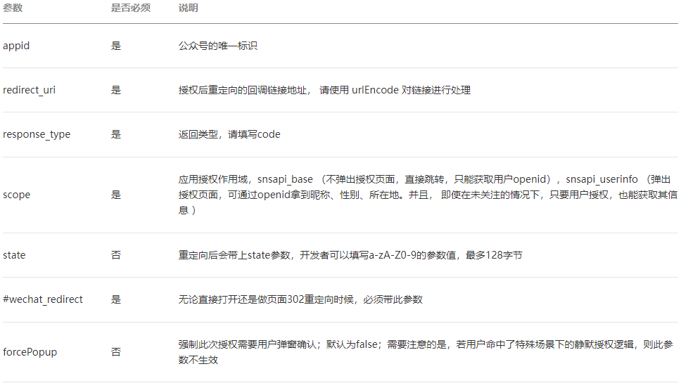

## 接口说明
### 目的
获取网页授权接口调用凭证access_token，并以此进行授权后接口调用
网页授权两种模式
snsapi_base模式：静默授权，授权后只能获取用户的openid。
snsapi_userinfo模式：需要用户手动同意，授权后可获取用户基本信息。
注：对于已关注公众号的用户，如果用户从公众号的会话或者自定义菜单进入本公众号的网页授权页，即使是scope为snsapi_userinfo，也是静默授权，用户无感知。
UnionID机制
如果开发者拥有多个移动应用、网站应用和公众账号，可通过获取用户基本信息中的unionid来区分用户的唯一性，因为同一用户，对同一个微信开放平台下的不同应用（移动应用、网站应用和公众账号），unionid是相同的。
注：UnionID在网页授权的时候伴随access_token获取接口一起返回，并且只有当scope为"snsapi_userinfo"时返回。
开发指南
第一步，用户同意授权，获取code
引导用户打开如下页面
https://open.weixin.qq.com/connect/oauth2/authorize?appid=APPID&redirect_uri=REDIRECT_URI&response_type=code&scope=SCOPE&state=STATE#wechat_redirect  
参数如下  

用户同意授权后
如果用户同意授权，页面将跳转至 redirect_uri/?code=CODE&state=STATE。code将会作为链接的一个参数返回
code说明：
code作为换取access_token的票据，每次用户授权带上的code将不一样，code只能使用一次，5分钟未被使用自动过期。
注意：在使用Vue开发时，路由最好使用history模式，否则在redirect_uri中需要使用路由跳转页面时，回调时会将路由路径拼接在#前，导致路由跳转出现问题。
如需要
http://localhost:8081/#/login?gameId=1234
调转后会被拼接成
http://localhost:8081/login?gameId=1234#/
导致页面无法正常跳转
第二步，通过code换取网页授权access_token
获取code后，请求以下链接获取access_token：
https://api.weixin.qq.com/sns/oauth2/access_token?appid=APPID&secret=SECRET&code=CODE&grant_type=authorization_code
参数如下

.png)

返回值（json格式）.png)

注意：由于公众号的secret和获取到的access_token安全级别都非常高，必须只保存在服务器，不允许传给客户端。后续刷新access_token、通过access_token获取用户信息等步骤，也必须从服务器发起。
第三步，刷新access_token（如果需要）
使用第二步的refresh_token后，请求以下链接获取access_token：
https://api.weixin.qq.com/sns/oauth2/refresh_token?appid=APPID&grant_type=refresh_token&refresh_token=REFRESH_TOKEN
refresh_token有效期为30天，access_token有效期为2个小时
第四步，拉取用户信息(需scope为 snsapi_userinfo)
此时开发者可以通过access_token和openid拉取用户信息了。
接口如下：

http：GET（请使用https协议)
https://api.weixin.qq.com/sns/userinfo?access_token=ACCESS_TOKEN&openid=OPENID&lang=zh_CN

