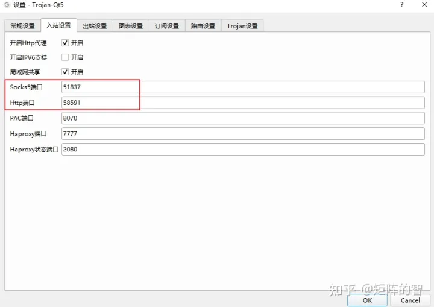
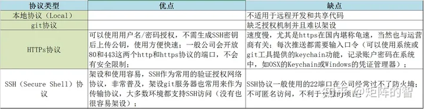
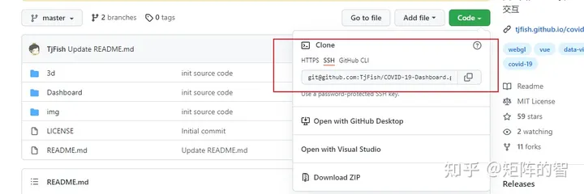

# 设置代理解决github被墙

[](https://www.zhihu.com/people/ju-zhen-de-zhi-9)

[TjFish](https://www.zhihu.com/people/ju-zhen-de-zhi-9)

软件工程

224 人赞同了该文章


经常发现，自己虽然有梯子，可以正常访问github页面，但是在发现“git clone”命令速度特别慢，有时还经常卡掉。本文通过设置git 代理，解决被墙问题。
着急的同学直接看**第三节-设置ssh代理（终极解决方案）**

##  前置要求

- 首先你得一个可用的梯子（代理）
- 其次，确认你的梯子的代理端口号

比如我用的trojan，在常规设置一栏可以看到**Socks5**端口号为51837，**Http**端口号为58591，记下这两个端口号，之后要用到。




git 有几种传输协议，在Github上主要用到的是**Https**和**SSH协议**。所以我们要做的是对git 命令的https 以及ssh流量做代理。



##  设置https 代理


Git代理有两种设置方式，分别是全局代理和只对Github代理，建议只对github 代理。
代理协议也有两种，分别是使用http代理和使用socks5代理，建议使用socks5代理。
注意下面代码的端口号需要根据你自己的代理端口设定，比如我的代理socks端口是51837。


**全局设置（不推荐）**

```bash
#使用http代理 
git config --global http.proxy http://127.0.0.1:58591
git config --global https.proxy https://127.0.0.1:58591
#使用socks5代理
git config --global http.proxy socks5://127.0.0.1:51837
git config --global https.proxy socks5://127.0.0.1:51837
```


**只对Github代理（推荐）**

```bash
#使用socks5代理（推荐）
git config --global http.https://github.com.proxy socks5://127.0.0.1:51837
#使用http代理（不推荐）
git config --global http.https://github.com.proxy http://127.0.0.1:58591
```


**取消代理**
当你不需要使用代理时，可以取消之前设置的代理。

```bash
git config --global --unset http.proxy git config --global --unset https.proxy
```

##  设置ssh代理（终极解决方案）


https代理存在一个局限，那就是没有办法做身份验证，每次拉取私库或者推送代码时，都需要输入github的账号和密码，非常痛苦。
设置ssh代理前，请确保你已经设置ssh key。可以参考[在 github 上添加 SSH key](https://link.zhihu.com/?target=https%3A//tjfish.github.io/posts/%E5%9C%A8github%E4%B8%8A%E6%B7%BB%E5%8A%A0SSH-key/) 完成设置
更进一步是设置ssh代理。只需要配置一个config就可以了。

```bash
# Linux、MacOS
vi ~/.ssh/config
# Windows 
到C:\Users\your_user_name\.ssh目录下，新建一个config文件（无后缀名）
```


将下面内容加到config文件中即可

对于windows用户，代理会用到connect.exe，你如果安装了Git都会自带connect.exe，如我的路径为C:\APP\Git\mingw64\bin\connect

```text
#Windows用户，注意替换你的端口号和connect.exe的路径
ProxyCommand "C:\APP\Git\mingw64\bin\connect" -S 127.0.0.1:51837 -a none %h %p

#MacOS用户用下方这条命令，注意替换你的端口号
#ProxyCommand nc -v -x 127.0.0.1:51837 %h %p

Host github.com
  User git
  Port 22
  Hostname github.com
  # 注意修改路径为你的路径
  IdentityFile "C:\Users\Your_User_Name\.ssh\id_rsa"
  TCPKeepAlive yes

Host ssh.github.com
  User git
  Port 443
  Hostname ssh.github.com
  # 注意修改路径为你的路径
  IdentityFile "C:\Users\Your_User_Name\.ssh\id_rsa"
  TCPKeepAlive yes
```


保存后文件后测试方法如下，返回successful之类的就成功了。

```text
# 测试是否设置成功
ssh -T git@github.com
```


之后都推荐走ssh拉取代码，再github 上选择clone地址时，选择ssh地址，入下图。这样`git push` 与 `git clone` 都可以直接走代理了，并且不需要输入密码。



##  原理部分


代理服务器就是你的电脑和互联网的中介。当您访问外网时（如[http://google.com](https://link.zhihu.com/?target=http%3A//google.com)) , 你的请求首先转发到代理服务器，然后代理服务器替你访问外网，并将结果原封不动的给你的电脑，这样你的电脑就可以看到外网的内容啦。
路径如下：

> 你的电脑->代理服务器->外网
> 外网->代理服务器->你的电脑


很多朋友配置代理之后，可以正常访问github 网页了，但是发现在本地克隆github仓库（git clone xxx）时还是报网络错误。那是因为git clone 没有走你的代理，所以需要设置git走你的代理才行。