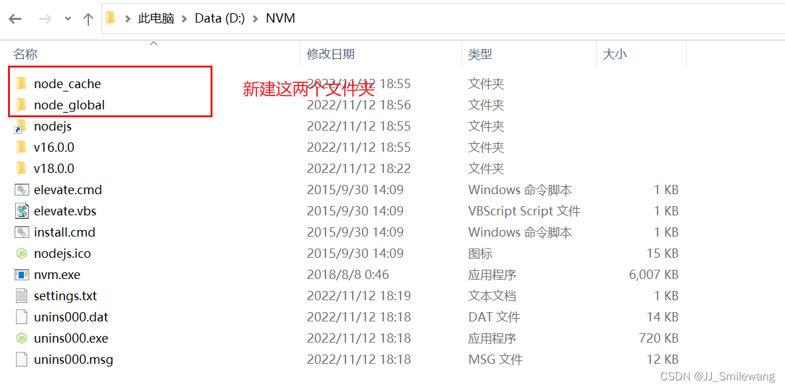
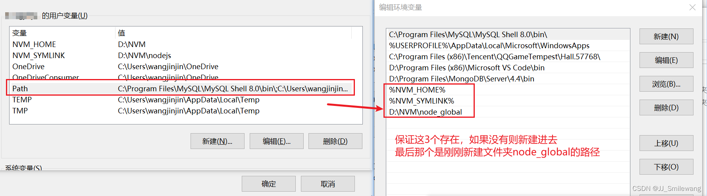
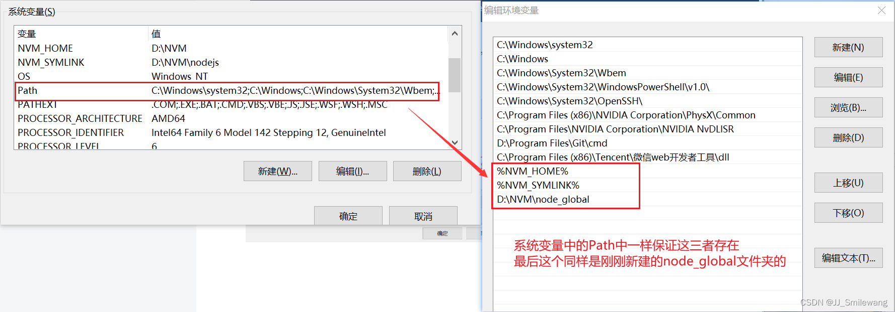
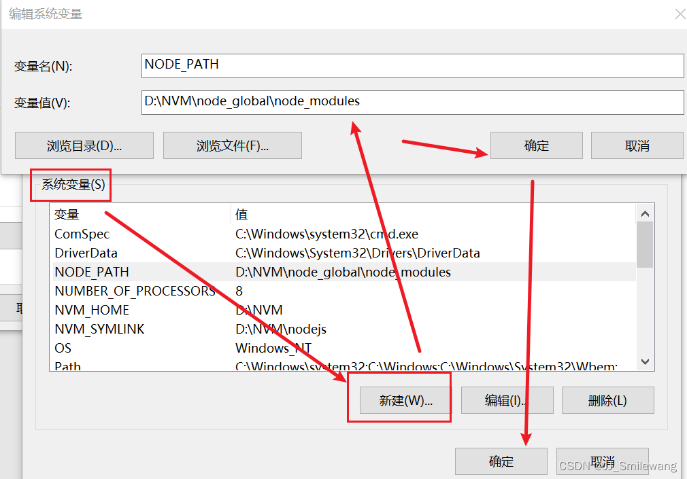

### node环境变量配置
**1.首先在NVM的安装目录新建两个文件夹node_global和node_cache**



**2.创建完两个文件夹后，在cmd窗口中输入以下命令（两个路径即是两个文件夹的路径）：**

```
npm config set prefix "D:\NVM\node_global"
npm config set cache "D:\NVM\node_cache"
```

**3.接下来设置电脑环境变量，右键“我的电脑”=》属性=》高级系统设置=》环境变量 进入以下环境变量对话框。**

（1）先设置用户变量 



**注意：【用户变量】中的path变量，%NVM_HOME%  和  %NVM_SYMLINK% 理论上是nvm安装成功后自动生成的。**

**如果有C:UsershuaAppDataRoaming npm，则将其修改为D:\NVM\node_global，如果没有就自己新建D:\NVM\node_global，总之保证有以上内容。**

（2）再设置系统变量 --- Path变量的设置和用户变量中一致



 **4.在【系统变量】新建环境变量 NODE_PATH，值为D:\NVM\node_global\node_modules，其中D:\NVM\node_global\node_modules是上述创建的全局模块安装路径文件夹**



**5.所有设置完点击确定，即配置完成。** 
————————————————

    版权声明：本文为博主原创文章，遵循 CC 4.0 BY-SA 版权协议，转载请附上原文出处链接和本声明。

原文链接：https://blog.csdn.net/JJ_Smilewang/article/details/127823953