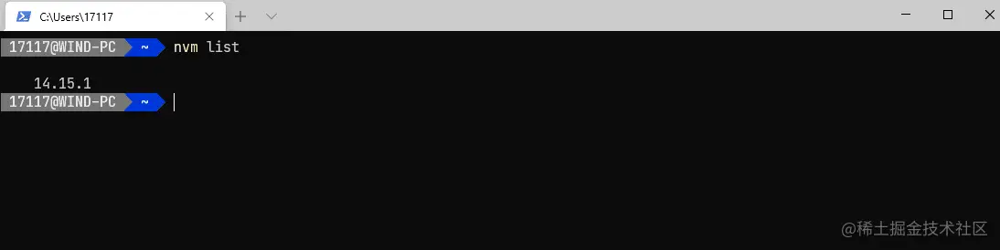

# windows下通过nvm安装node(内含卸载node)

[JuvenileAndSea](https://juejin.cn/user/4080986139408637/posts)

日常开发中有时候会维护多个项目，随着时间跨度的增加而我们前端技术又日新月异，不可避免有些项目是不同的node版本依赖。这个时候我们就想要是有一个node的版本切换(管理)工具那就好了，事实上的确有那么一个工具那就是[nvm](https://link.juejin.cn/?target=https%3A%2F%2Fgithub.com%2Fcoreybutler%2Fnvm-windows)

#### 一.如果你已经安装了node，那么你需要先卸载node，如果你没有安装那直接跳过这一步到下一步

1.先看看我们是否安装了node，打开你的终端输入

```js
js
复制代码node -v
```


2.打开控制面板=>打开程序和功能=>右上角搜索输入node


3.找到之后右键卸载


再次查看node

```js
js
复制代码node -v
```


4.可以看到node已经被卸载了，但是别慌为了确保彻底删除node在看看你的node安装目录默认是C:\Program Files中还有没有node文件夹，有的话一起删除

5.再看看C:\Users\用户名 文件夹下有没有.npmrc以及.yarnrc等等统统删除

6.再去看看你的环境变量有没有node相关的，有的话也一起删除了

#### 二.安装nvm

1.去github下载最新的[nvm](https://link.juejin.cn/?target=https%3A%2F%2Fgithub.com%2Fcoreybutler%2Fnvm-windows%2Freleases)找到nvm-setup.zip点击下载


2.解压缩安装


3.双击安装，最好让他安装到默认路径


4.选择node安装路径


5.安装结束


6.在终端中查看是否安装成功

```js
js
复制代码nvm version
```

成功出现版本号那么恭喜你安装nvm成功


#### 三.安装node

1.打开[node官网](https://link.juejin.cn/?target=https%3A%2F%2Fnodejs.org%2Fzh-cn%2F)查看最新版本复制一下最新版本号


2.安装你复制的node版本

```js
js
复制代码nvm install 14.15.1
```


3.可以看到安装失败了，因为这个资源我们访问失败了，不要着急接下来打开我们的nvm安装目录找到settings.txt


4.双击打开在后面添加淘宝的源地址，然后保存

```js
js复制代码node_mirror: https://npm.taobao.org/mirrors/node/
npm_mirror: https://npm.taobao.org/mirrors/npm/
```


5.再次尝试安装node


6.查看nvm中的node列表

```js
js
复制代码nvm list
```



7.切换node版本nvm use 后面跟版本号就行

```js
js
复制代码nvm use 14.15.1
```


8.再次查看nvm中的node列表，可以看见版本号前面有一个* 号，这个*号就是你当前的node版本

```js
js
复制代码nvm list
```


9.查看当前的node版本以及npm版本，可以看到我们现在的node是14.15.1 npm是6.14.8

```js
js复制代码node -v
npm -v
```


10.去node官网查看，这里我们复制了10.12.0的版本号[历史版本](https://link.juejin.cn/?target=https%3A%2F%2Fnodejs.org%2Fzh-cn%2Fdownload%2Freleases%2F) 

10.安装10.12.0版node

```js
js
复制代码nvm install 10.12.0
```


12.查看现在的node列表


13.切换node版本为10.12.0，并查看node列表可以看到10.12.0的前面多了一个*


14.验证当前node版本以及npm版本，可以看到以及成功node切换到10.12.0 npm到6.4.1


#### 这样就通过nvm成功安装node自己想要的版本了，切可以随时切换node版本。再也不用担心别人让我们维护老掉牙的项目而我们却没有对应版本的node了


# Node.js 统一全局模块安装路径配置

## 1. nvm下载

## 2. nvm常用的几个命令


**修改nvm下载源**
 在nvm目录中找到 setting.txt 添加以下代码

```ruby
node_mirror: https://npm.taobao.org/mirrors/node/
npm_mirror: https://npm.taobao.org/mirrors/npm/
```

## 3. npm管理(pnpm同npm)

使用 nvm 时，默认的 prefix 是当前激活的 Node.js 版本的安装路径。
 带来一个问题是：切换版本之后，之前安装全局命令模块需要重新安装，非常不方便。
 解决方案是配置统一的全局模块安装路径。
 新建npm_global和npm_cache文件夹，分别用于npm包的全局安装路径和全局cache路径

**npm查看各种全局路径的命令**

- 查看当前npm包的全局安装路径

```swift
npm prefix -g 
```

- 查看当前npm包的全局cache路径

```csharp
npm config get cache
```

- 查看配置列表

```undefined
npm config ls
```

- 查看配置列表的全部信息

```undefined
npm config ls -l
```

**npm修改全局路径命令**

- 修改npm的包的全局安装路径

```swift
npm config set prefix "D:\Program Files\DevTools\npm\node_global"
```

- 修改npm的包的全局cache位置

```bash
npm config set cache "D:\Program Files\DevTools\npm\node_cache"
```

**配置环境变量**

- 将npm包全局安装路径配置在环境变量中

此电脑 -> 属性 -> 高级系统设置 -> 环境变量 -> 系统变量 -> path ->编辑 - > 新增路径 - D:\Program Files\DevTools\npm\node_global（路径可以根据npm prefix -g查看）


**注意pnpm环境变量配置**


## 4. yarn管理

**安装yarn**
 yarn的默认缓存和存储包的路径都在C盘，所以最好在安装后也进行修改

**yarn查看各种路径命令**

- 查看 yarn 全局bin位置(prefix)

```csharp
yarn global bin
```

- 查看 yarn 全局安装位置(folder)

```csharp
yarn global dir
```

- 查看 yarn 全局cache位置(cache)

```undefined
yarn cache dir
```

- 查看配置列表

```cpp
yarn config list
```

**yarn修改路径命令**

- 改变 yarn 全局bin位置(prefix)

```swift
yarn config set prefix "D:\Program Files\DevTools\npm\yarn_global\bin"
```

- 改变 yarn 全局安装位置(folder)

```csharp
yarn config  set global-folder "D:\Program Files\DevTools\npm\yarn_global"
```

- 改变 yarn 全局cache位置(cache)

```bash
yarn config set cache-folder "D:\Program Files\DevTools\npm\yarn_cache"
```

**配置环境变量**
 将 D:\Program Files\DevTools\node.js\yarn_global 添加到环境变量的path变量中，若该目录下自动生成了bin目录，则添加 D:\Program Files\DevTools\node.js\yarn_global\bin 到环境变量中


作者：刺猬丶
链接：https://www.jianshu.com/p/f5a7cedba59b
来源：简书
著作权归作者所有。商业转载请联系作者获得授权，非商业转载请注明出处。